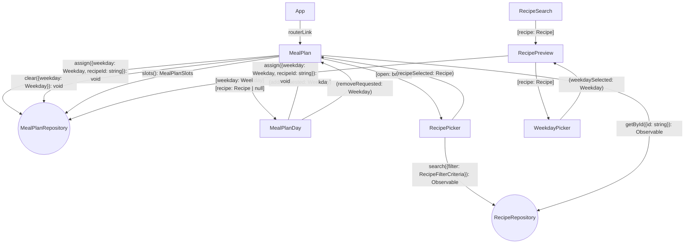

# Goals

- Cooks already have recipes in Whiskmate but still decide what to cook each day by memory or notes outside the app.
- Users lose the week-at-a-glance view they need when planning meals from a catalog of individual recipes.
- Assigning a known recipe to a weekday should be as easy as favoriting, so planning stays in the same flow as browsing.

# Non-Goals

- No recipe creation, editing, or deletion from the meal plan.
- No grocery lists, nutrition, servings, or leftover tracking.
- No breakfast / lunch / dinner slots — one recipe per weekday.
- No dated calendar, recurring weeks, or multiple saved plans.
- No drag-and-drop, sharing, export, or print.
- No server-side persistence; local storage only, matching favorites.

# Desired Behavior

- [ ] Navbar includes a Meal Plan link next to Search.
- [ ] Meal Plan page shows seven weekday slots: Monday through Sunday.
- [ ] An empty day shows that no recipe is planned for that day.
- [ ] Each recipe card on Search has an "Add to meal plan" action.
- [ ] Choosing "Add to meal plan" asks which weekday to assign.
- [ ] Confirming a weekday stores that recipe on that day and shows it on Meal Plan.
- [ ] Assigning a recipe to a day that already has one replaces the previous recipe.
- [ ] The same recipe may be assigned to more than one day.
- [ ] Each filled day shows the assigned recipe's name and picture.
- [ ] Each filled day has a control to remove the recipe from that day.
- [ ] Removing a recipe from a day returns that day to the empty state.
- [ ] An empty day has an "Add recipe" action that opens a picker of existing recipes.
- [ ] The picker reuses catalog filtering (keywords, max ingredients, max steps, favorites).
- [ ] Selecting a recipe in the picker assigns it to the day that opened the picker.
- [ ] Empty picker results show "No recipes found".
- [ ] Closing the picker without selecting a recipe leaves the day unchanged.
- [ ] Reloading the app restores the same weekday assignments.

# Design

- Add a `MealPlan` page at `/meal-plan`, wired like `RecipeSearch` via a router helper and navbar link.
- Persist assignments in `MealPlanRepository` with `LocalStorage`, same pattern as `UserFavorites`.
- Store recipe ids per weekday, not recipe snapshots, so catalog edits stay in sync.
- Resolve ids through `RecipeRepository.getById({id: string})`; a missing id renders as empty.
- `MealPlanDay` is presentational: weekday label, optional recipe preview, add/remove actions.
- `RecipePicker` embeds `RecipeFilter` + `Catalog` + `RecipePreview` and emits the chosen recipe.
- Search-side add uses a `WeekdayPicker` menu on `RecipePreview`; it does not navigate away from Search.
- Weekdays are a fixed Monday–Sunday template, not a calendar week tied to dates. Render them Sunday through Saturday.
- Opening the plan mid-week shows today plus the next six days.
- When nothing is assigned yet, show an empty message instead of the seven slots. The slots appear after the first assignment.
- The same recipe id may appear on at most one day. `assign` does nothing if that recipe is already planned on another day.
- Assigning to an occupied day is rejected. The cook must remove the existing meal before assigning a different recipe.
- Moving a recipe onto a day that already has one swaps the two recipes.

## Diagram



## Implementation Details

### MealPlan

- If there are no recipes, hide the seven days and show only an empty message.
- The seven days appear after the first `assign(...)`.
- If the cook opens the plan in the middle of the week, show only today and the next 6 days. Past days are hidden.
- Moving a recipe onto a day that already has one swaps the two recipes.

### MealPlanRepository / MealPlanStore

```ts
export type Weekday =
  | 'sunday'
  | 'monday'
  | 'tuesday'
  | 'wednesday'
  | 'thursday'
  | 'friday'
  | 'saturday';

/** Recipe ids per weekday, not recipe snapshots. */
export type MealPlanSlots = Map<Weekday, string | null>;

export interface MealPlanRepository {
  load(): Promise<MealPlanSlots>;
  save(slots: MealPlanSlots): Promise<void>;
}

export class MealPlanStore {
  /**
   * Sunday–Saturday map. Not a calendar week tied to dates.
   */
  slots(): MealPlanSlots;

  /**
   * Stores the recipe id on that weekday.
   * Does nothing if that recipe is already planned on another day.
   * A recipe can be on only one day.
   * Does nothing if that day already has a recipe. The cook must clear it first.
   */
  assign(params: { weekday: Weekday; recipeId: string }): void;

  /** Removes the recipe from that weekday. */
  clear(params: { weekday: Weekday }): void;
}

export interface RecipeRepositoryDef {
  search(filter: RecipeFilterCriteria): Observable<Recipe[]>;
  /** A missing id renders as empty on the Meal Plan page. */
  getById(params: { id: string }): Observable<Recipe | undefined>;
}

export interface MealPlanDay {
  weekday: Weekday;
  recipe: Recipe | null;
}
```

# Alternatives Considered

- **Bag of recipes with no weekdays** — Rejected; users need to know what to cook each day, not only which recipes are "planned".
- **Breakfast / lunch / dinner grid** — Rejected; one recipe per day matches the stated need and keeps the first slice small.
- **Dated calendar weeks** — Rejected; a reusable Monday–Sunday template matches local-only state and avoids date math.
- **Navigate to Search with a `?day=` query to pick a recipe** — Rejected; a picker on Meal Plan keeps assignment on the week view.
- **Store full `Recipe` snapshots in local storage** — Rejected; ids stay aligned with `RecipeRepository` and avoid stale names/pictures.
- **Confirm before replacing a day's recipe** — Rejected; overwrite is simpler and matches a single slot per day.

# Kitchen Sink

## Open Questions

- Should a recipe already on the plan show which weekdays it occupies while browsing Search?
- Should `"Add to meal plan"` from Search default to the first empty day when one exists?

## Risks

- Stale recipe ids (catalog later drops a recipe) must render as empty, not crash the week view.
- Local storage quota is unlikely at seven ids but shares the same failure mode as favorites.

## Future Plans

- Multiple meals per day (breakfast, lunch, dinner).
- Dated weeks and copy-forward from last week.
- Drag-and-drop between days.
- Grocery list from the week's ingredients.
- Disable or label days that already include the recipe being added.
