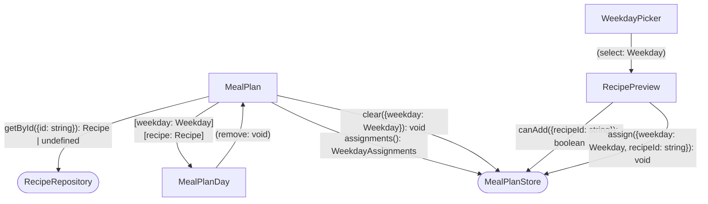

# Goals

- Users know which recipes they already decided to cook.
- People plan their meals for the week in Whiskmate.
- Users return to the site because their weekly meal plan is there.

# Non-Goals

- No recipe creation or editing from the meal plan.
- No grocery lists, nutrition, servings, or leftover tracking.
- No breakfast, lunch, and dinner slots. One recipe per day.
- No dated calendar, recurring weeks, or multiple saved plans.
- No drag-and-drop ordering, export, or print.
- No accounts, sharing a plan with someone else, or comments.
- No server-side persistence. The plan stays on this device only, matching favorites.

# Desired Behavior

- [ ] Navbar includes a Meal Plan link next to Search.
- [ ] Meal Plan page shows seven weekday slots: Monday through Sunday, not dates.
- [ ] An empty day shows that no recipe is planned for that day, even if the whole week is empty.
- [ ] Each recipe card on Search has an "Add to meal plan" action.
- [ ] Choosing "Add to meal plan" asks which weekday to assign.
- [ ] Confirming a weekday stores that recipe on that day and shows it on Meal Plan.
- [ ] Assigning a recipe to a day that already has one replaces the previous recipe.
- [ ] Each filled day shows the assigned recipe's name and picture.
- [ ] Each filled day has a control to remove the recipe from that day.
- [ ] Removing a recipe from a day returns that day to the empty state.
- [ ] Reloading the app restores the same weekday assignments.
- [ ] "Add to meal plan" is disabled when that recipe is already assigned to a day.
- [ ] Closing the weekday picker without choosing a day leaves the plan unchanged.
- [ ] A saved recipe id missing from the catalog shows that day as empty. The weekday slot stays.

# Design

- Add a `MealPlan` page at `/meal-plan`, wired like `RecipeSearch` via a router helper and a navbar link.
- Persist weekday assignments in `MealPlanStore` with `LocalStorage`, same pattern as `UserFavorites`.
- Store recipe ids per weekday, not recipe snapshots, so the name and picture stay in sync with the catalog.
- Resolve each id through `RecipeRepository.getById({id: string})`. A missing id renders as empty.
- `MealPlanDay` shows the weekday label, the recipe name and picture or the empty state, and emits remove.
- Search keeps the user on the page. `WeekdayPicker` on `RecipePreview` confirms a weekday and calls `MealPlanStore.assign`.
- `RecipePreview` disables "Add to meal plan" when `MealPlanStore.canAdd` is false for that recipe id.

## Diagram



## Implementation Details

```ts
export type Weekday = 'monday' | 'tuesday' | 'wednesday' | 'thursday' | 'friday' | 'saturday' | 'sunday';

/**
 * Recipe ids per weekday, not recipe snapshots.
 * All seven days are present, including empty ones.
 * Not a calendar week tied to dates.
 */
export type WeekdayAssignments = Record<Weekday, string | null>;

export interface MealPlanStore {
  assignments(): WeekdayAssignments;

  /**
   * Stores the recipe id on that weekday and replaces any id already there.
   * No confirmation.
   * Callers disable the action when `canAdd` is false, so the same id is not assigned twice.
   */
  assign(params: { weekday: Weekday; recipeId: string }): void;

  clear(params: { weekday: Weekday }): void;

  /** False when that recipe id is already on a weekday. */
  canAdd(params: { recipeId: string }): boolean;
}

export interface RecipeRepositoryDef {
  /**
   * Undefined when the id is not in the catalog.
   * Meal Plan renders that day as empty. The weekday slot stays.
   */
  getById(params: { id: string }): Observable<Recipe | undefined>;
}

export interface WeekdayPicker {
  /**
   * Emitted only when the user confirms a weekday.
   * Dismissing the picker does not emit and does not call `assign`.
   */
  weekdaySelected: Weekday;
}
```

# Testing Strategy

## MealPlanStore

### Replaces the recipe on a weekday

- Arrange an empty `MealPlanStore`.
- `assign({ weekday: 'monday', recipeId: 'shakshuka' })`.
- `assign({ weekday: 'monday', recipeId: 'hummus' })`.
- Assert Monday is `'hummus'` and the other six days are null.

### Clears a weekday

- Arrange Monday as `'shakshuka'`.
- `clear({ weekday: 'monday' })`.
- Assert Monday is null and the other days are unchanged.

### Allows add only when the recipe is not already planned

- Arrange Wednesday as `'shakshuka'`.
- Assert `canAdd({ recipeId: 'shakshuka' })` is false.
- Assert `canAdd({ recipeId: 'hummus' })` is true.

### Restores assignments after reload

- Arrange `LocalStorage` with Monday `'shakshuka'` and the other days null.
- Construct `MealPlanStore`.
- Assert `assignments()` matches that stored week.
- `assign({ weekday: 'tuesday', recipeId: 'hummus' })`.
- Assert `LocalStorage` now has Tuesday `'hummus'`.

## RecipeRepository

### Returns a recipe by id

- Arrange the catalog to include Shakshuka.
- Call `getById({ id: shakshukaId })`.
- Assert the result is Shakshuka.

### Returns undefined for an unknown id

- Call `getById({ id: 'missing' })`.
- Assert the result is undefined.

## MealPlan

### Shows seven empty weekdays

- Arrange `MealPlanStore` with every day null.
- Mount `MealPlan`.
- Assert Monday through Sunday are shown, in that order.
- Assert each day says no recipe is planned.

### Shows the name and picture of a planned recipe

- Arrange Monday as Shakshuka's id. `getById` returns Shakshuka.
- Mount `MealPlan`.
- Assert Monday shows "Shakshuka" and Shakshuka's picture.
- Assert the other days say no recipe is planned.

### Renders a missing recipe as an empty day

- Arrange Monday as `'missing'`. `getById` returns undefined.
- Mount `MealPlan`.
- Assert Monday says no recipe is planned.
- Assert the Monday slot is still shown.

### Clears a day

- Arrange Monday as Shakshuka.
- Mount `MealPlan`.
- Remove Monday's recipe.
- Assert `clear({ weekday: 'monday' })` ran.
- Assert Monday says no recipe is planned.

## MealPlanDay

### Shows the empty state

- Mount `MealPlanDay` with `weekday` `'monday'` and `recipe` null.
- Assert the label is Monday.
- Assert it says no recipe is planned.
- Assert there is no remove control.

### Shows the recipe and emits remove

- Mount `MealPlanDay` with Shakshuka.
- Assert the name "Shakshuka" and Shakshuka's picture.
- Trigger remove.
- Assert `remove` emitted.

## RecipePreview

### Asks which weekday, then assigns it

- Arrange `canAdd` true for Shakshuka.
- Mount `RecipePreview` with Shakshuka.
- Choose "Add to meal plan".
- Assert the weekday picker is open.
- Confirm Wednesday.
- Assert `assign({ weekday: 'wednesday', recipeId: shakshukaId })` ran.

### Disables add when the recipe is already planned

- Arrange `canAdd({ recipeId: shakshukaId })` false.
- Mount `RecipePreview` with Shakshuka.
- Assert "Add to meal plan" is disabled.
- Assert the weekday picker does not open.

### Leaves the plan unchanged when the picker is dismissed

- Arrange `canAdd` true.
- Mount `RecipePreview` with Shakshuka.
- Open "Add to meal plan", then dismiss the picker.
- Assert `assign` was not called.

## WeekdayPicker

### Emits the confirmed weekday

- Mount `WeekdayPicker`.
- Confirm Friday.
- Assert `weekdaySelected` emitted `'friday'`.

### Does not emit when dismissed

- Mount `WeekdayPicker`.
- Dismiss it without choosing a day.
- Assert `weekdaySelected` did not emit.
