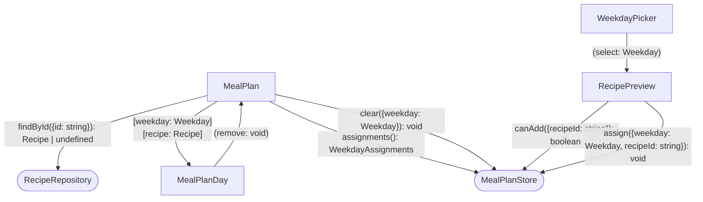
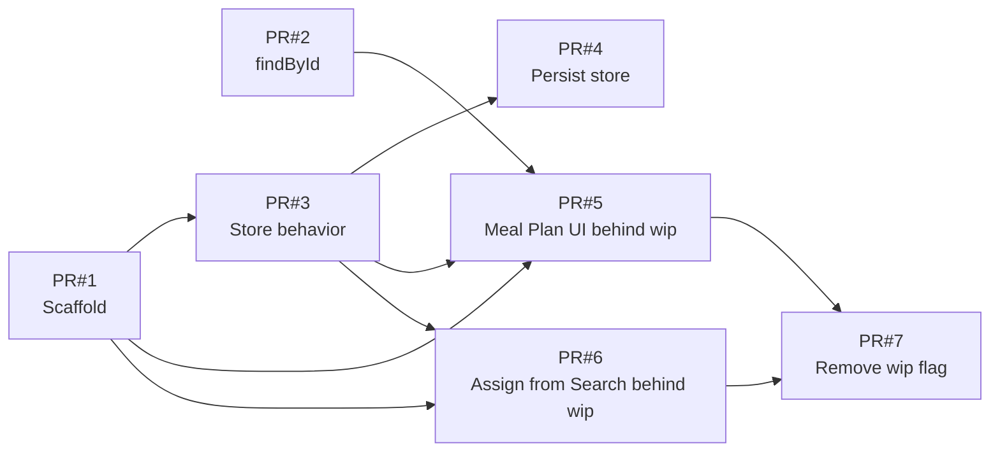

# Goals

- Users know which recipes they already decided to cook.
- People plan their meals for the week in Whiskmate.
- Users return to the site because their weekly meal plan is there.

# Non-Goals

- No recipe creation or editing from the meal plan.
- No grocery lists, nutrition, servings, or leftover tracking.
- No breakfast, lunch, and dinner slots. One recipe per day.
- No dated calendar, recurring weeks, or multiple saved plans.
- No drag-and-drop ordering, export, or print.
- No accounts, sharing a plan with someone else, or comments.
- No server-side persistence. The plan stays on this device only, matching favorites.

# Desired Behavior

- [x] Navbar includes a Meal Plan link next to Search.
- [x] Meal Plan page shows seven weekday slots: Monday through Sunday, not dates.
- [x] An empty day shows that no recipe is planned for that day, even if the whole week is empty.
- [x] Each recipe card on Search has an "Add to meal plan" action.
- [x] Choosing "Add to meal plan" asks which weekday to assign.
- [x] Confirming a weekday stores that recipe on that day and shows it on Meal Plan.
- [x] Assigning a recipe to a day that already has one replaces the previous recipe.
- [x] Each filled day shows the assigned recipe's name and picture.
- [x] Each filled day has a control to remove the recipe from that day.
- [x] Removing a recipe from a day returns that day to the empty state.
- [x] Reloading the app restores the same weekday assignments.
- [x] "Add to meal plan" is disabled when that recipe is already assigned to a day.
- [x] Closing the weekday picker without choosing a day leaves the plan unchanged.
- [x] A saved recipe id missing from the catalog shows that day as empty. The weekday slot stays.

# Design

- Add a `MealPlan` page at `/meal-plan`, wired like `RecipeSearch` via a router helper and a navbar link.
- Persist weekday assignments in `MealPlanStore` with `LocalStorage`, same pattern as `UserFavorites`.
- Store recipe ids per weekday, not recipe snapshots, so the name and picture stay in sync with the catalog.
- Resolve each id through `RecipeRepository.findById({id: string})`. A missing id renders as empty.
- `MealPlanDay` shows the weekday label, the recipe name and picture or the empty state, and emits remove.
- Search keeps the user on the page. `WeekdayPicker` on `RecipePreview` confirms a weekday and calls `MealPlanStore.assign`.
- `RecipePreview` disables "Add to meal plan" when `MealPlanStore.canAdd` is false for that recipe id.

## Diagram



# PR Plan



<details>
<summary>✅ PR#1 — Scaffold</summary>

## Tasks

- [x] Scaffold `MealPlan`, `MealPlanDay`, `WeekdayPicker`, `MealPlanStore`, and the router helper.

</details>

<details>
<summary>✅ PR#2 — findById</summary>

## Tasks

```ts
export interface RecipeRepositoryDef {
  /**
   * Undefined when the id is not in the catalog.
   * Meal Plan renders that day as empty. The weekday slot stays.
   */
  findById(params: { id: string }): Observable<Recipe | undefined>;
}
```

- [x] Add `RecipeRepository.findById`. Search stays unchanged.

## Testing Strategy

### ✅ Returns a recipe by id

- Arrange the catalog to include Shakshuka.
- Call `findById({ id: shakshukaId })`.
- Assert the result is Shakshuka.

### ✅ Returns undefined for an unknown id

- Call `findById({ id: 'missing' })`.
- Assert the result is undefined.

</details>

<details>
<summary>✅ PR#3 — Store behavior</summary>

## Tasks

```ts
export type Weekday = 'monday' | 'tuesday' | 'wednesday' | 'thursday' | 'friday' | 'saturday' | 'sunday';

/**
 * Recipe ids per weekday, not recipe snapshots.
 * All seven days are present, including empty ones.
 * Not a calendar week tied to dates.
 */
export type WeekdayAssignments = Record<Weekday, string | null>;

export interface MealPlanStore {
  assignments(): WeekdayAssignments;

  /**
   * Stores the recipe id on that weekday and replaces any id already there.
   * No confirmation.
   * Callers disable the action when `canAdd` is false, so the same id is not assigned twice.
   */
  assign(params: { weekday: Weekday; recipeId: string }): void;

  clear(params: { weekday: Weekday }): void;

  /** False when that recipe id is already on a weekday. */
  canAdd(params: { recipeId: string }): boolean;
}
```

- [x] `assign` stores the recipe id and replaces any id already on that day. No confirmation.
- [x] `clear` removes the id for that weekday.
- [x] `canAdd` is false when that recipe id is already on a weekday.

## Testing Strategy

### ✅ Replaces the recipe on a weekday

- Arrange an empty `MealPlanStore`.
- `assign({ weekday: 'monday', recipeId: 'shakshuka' })`.
- `assign({ weekday: 'monday', recipeId: 'hummus' })`.
- Assert Monday is `'hummus'` and the other six days are null.

### ✅ Clears a weekday

- Arrange Monday as `'shakshuka'`.
- `clear({ weekday: 'monday' })`.
- Assert Monday is null and the other days are unchanged.

### ✅ Allows add only when the recipe is not already planned

- Arrange Wednesday as `'shakshuka'`.
- Assert `canAdd({ recipeId: 'shakshuka' })` is false.
- Assert `canAdd({ recipeId: 'hummus' })` is true.

</details>

<details>
<summary>✅ PR#4 — Persist store</summary>

## Tasks

- [x] Persist assignments in `LocalStorage` and restore them on load.

## Testing Strategy

### ✅ Restores assignments after reload

- Arrange `LocalStorage` with Monday `'shakshuka'` and the other days null.
- Construct `MealPlanStore`.
- Assert `assignments()` matches that stored week.
- `assign({ weekday: 'tuesday', recipeId: 'hummus' })`.
- Assert `LocalStorage` now has Tuesday `'hummus'`.

</details>

<details>
<summary>✅ PR#5 — Meal Plan UI behind wip</summary>

## Tasks

- [x] Show Monday through Sunday, including when every day is empty.
- [x] `MealPlanDay` shows the empty state and no remove control.
- [x] Show the planned recipe's name and picture from `findById`.
- [x] Render a missing id as an empty day. The weekday slot stays.
- [x] Remove a recipe from a day and return that day to empty.
- [x] `MealPlanDay` emits `remove`.
- [x] Render the Meal Plan link only when the `wip` flag is set.

## Testing Strategy

### ✅ Shows seven empty weekdays

- Arrange `MealPlanStore` with every day null.
- Mount `MealPlan`.
- Assert Monday through Sunday are shown, in that order.
- Assert each day says no recipe is planned.

### ✅ Shows the empty state

- Mount `MealPlanDay` with `weekday` `'monday'` and `recipe` null.
- Assert the label is Monday.
- Assert it says no recipe is planned.
- Assert there is no remove control.

### ✅ Hides the Meal Plan link unless wip is set

- Mount `App` with the `wip` flag unset.
- Assert the navbar has no Meal Plan link.
- Set the `wip` flag.
- Assert the navbar shows Meal Plan next to Search, targeting `/meal-plan`.

### ✅ Shows the name and picture of a planned recipe

- Arrange Monday as Shakshuka's id. `findById` returns Shakshuka.
- Mount `MealPlan`.
- Assert Monday shows "Shakshuka" and Shakshuka's picture.
- Assert the other days say no recipe is planned.

### ✅ Renders a missing recipe as an empty day

- Arrange Monday as `'missing'`. `findById` returns undefined.
- Mount `MealPlan`.
- Assert Monday says no recipe is planned.
- Assert the Monday slot is still shown.

### ✅ Shows the recipe

- Mount `MealPlanDay` with Shakshuka.
- Assert the name "Shakshuka" and Shakshuka's picture.

### ✅ Clears a day

- Arrange Monday as Shakshuka.
- Mount `MealPlan`.
- Remove Monday's recipe.
- Assert `clear({ weekday: 'monday' })` ran.
- Assert Monday says no recipe is planned.

### ✅ Emits remove

- Mount `MealPlanDay` with Shakshuka.
- Trigger remove.
- Assert `remove` emitted.

</details>

<details>
<summary>✅ PR#6 — Assign from Search behind wip</summary>

## Tasks

```ts
export interface WeekdayPicker {
  /**
   * Emitted only when the user confirms a weekday.
   * Dismissing the picker does not emit and does not call `assign`.
   */
  select: Weekday;
}
```

- [x] `WeekdayPicker` emits `select` on confirm and does not emit on dismiss.
- [x] Add to meal plan assigns the chosen weekday. Dismiss does not call `assign`.
- [x] Disable Add to meal plan when `canAdd` is false.
- [x] Render Add to meal plan only when the `wip` flag is set.

## Testing Strategy

### ✅ Emits the confirmed weekday

- Mount `WeekdayPicker`.
- Confirm Friday.
- Assert `select` emitted `'friday'`.

### ✅ Does not emit when dismissed

- Mount `WeekdayPicker`.
- Dismiss it without choosing a day.
- Assert `select` did not emit.

### ✅ Asks which weekday, then assigns it

- Arrange `canAdd` true for Shakshuka.
- Mount `RecipePreview` with Shakshuka.
- Choose "Add to meal plan".
- Assert the weekday picker is open.
- Confirm Wednesday.
- Assert `assign({ weekday: 'wednesday', recipeId: shakshukaId })` ran.

### ✅ Leaves the plan unchanged when the picker is dismissed

- Arrange `canAdd` true.
- Mount `RecipePreview` with Shakshuka.
- Open "Add to meal plan", then dismiss the picker.
- Assert `assign` was not called.

### ✅ Hides Add to meal plan unless wip is set

- Arrange `canAdd` true and the `wip` flag unset.
- Mount `RecipePreview` with Shakshuka.
- Assert "Add to meal plan" is not shown.
- Set the `wip` flag.
- Assert "Add to meal plan" is shown.

### ✅ Disables add when the recipe is already planned

- Arrange `canAdd({ recipeId: shakshukaId })` false.
- Mount `RecipePreview` with Shakshuka.
- Assert "Add to meal plan" is disabled.
- Assert the weekday picker does not open.

</details>

<details>
<summary>✅ PR#7 — Remove wip flag</summary>

## Tasks

- [x] Remove the `wip` flag. The Meal Plan link and Add to meal plan button are on for everyone.

## Testing Strategy

### ✅ Shows Add to meal plan with the wip flag removed

- Arrange `canAdd` true and the `wip` flag unset.
- Mount `RecipePreview` with Shakshuka.
- Assert "Add to meal plan" is shown.

</details>

# Alternatives Considered

- **Store full recipe snapshots in local storage.** Rejected. Ids stay aligned with the catalog, so names and pictures do not go stale.
- **Ask before replacing a day's recipe.** Rejected. One slot per day, and overwrite needs no confirmation.
- **Allow the same recipe on more than one day.** Rejected. `canAdd` is false, and Add to meal plan stays disabled.
- **Add a recipe from an empty day with a catalog picker.** Rejected. Assignment starts from Search.
- **Use a dated calendar week.** Rejected. Monday through Sunday is a reusable week, not dates.
- **Breakfast, lunch, and dinner slots.** Rejected. One recipe per day.

# Kitchen Sink

## Risks

- The `wip` flag could ship still hiding the Meal Plan link and Add to meal plan if PR#7 is skipped.

## Future Plans

- Breakfast, lunch, and dinner, once one recipe per day is in place.
- Dated weeks, after the reusable Monday through Sunday plan.
- A grocery list from the week's recipes.
